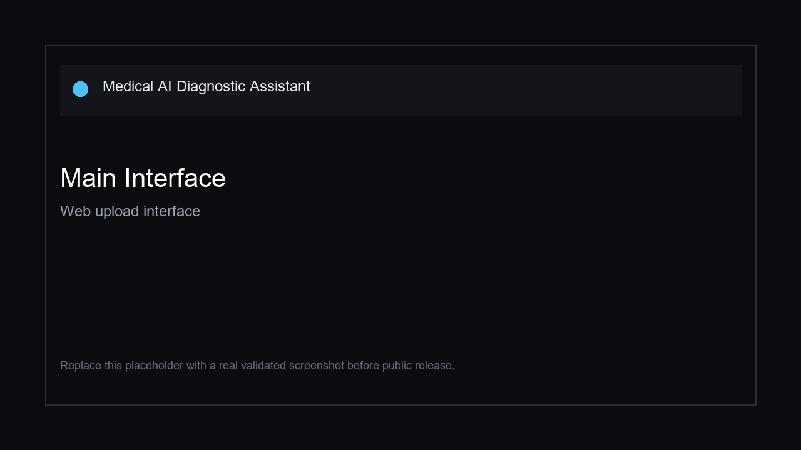
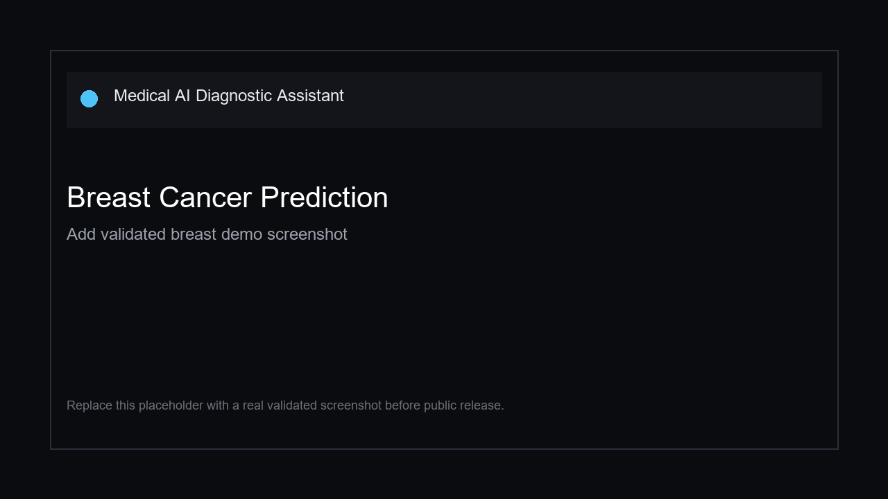
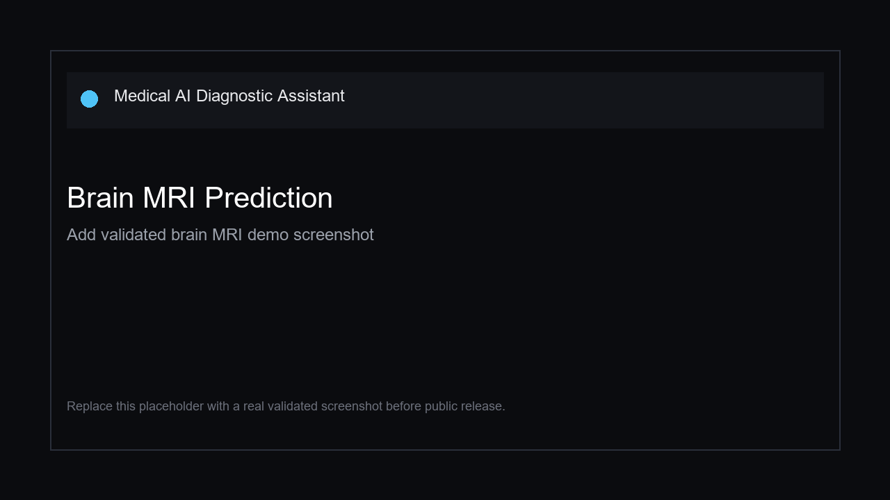
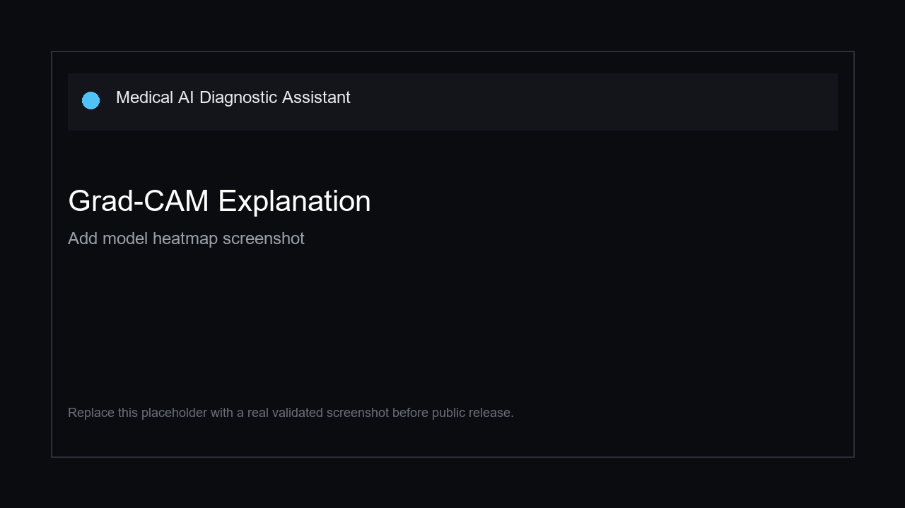

# Medical AI Diagnostic Assistant

AI-powered medical imaging diagnostic assistant built with **PyTorch**, **EfficientNet-B0**, **Grad-CAM**, and **FastAPI**. The application provides a web interface and API endpoints for breast histopathology and brain MRI image classification.

> This project is intended for education, research, and portfolio demonstration. It is not a certified medical device and must not be used as a substitute for clinical diagnosis.

## Repository Description

Use this text in the GitHub repository description:

```text
AI-powered medical imaging diagnostic assistant using PyTorch, EfficientNet, Grad-CAM and FastAPI for Breast Cancer and Brain Tumor classification.
```

Recommended GitHub topics:

```text
artificial-intelligence deep-learning pytorch medical-imaging healthtech fastapi gradcam computer-vision breast-cancer brain-tumor machine-learning
```

## Features

- Breast histopathology classification: `Benign` or `Malignant`
- Brain MRI classification: `Glioma`, `Meningioma`, `No Tumor`, or `Pituitary`
- Grad-CAM heatmap generation for visual model explainability
- FastAPI backend with image upload endpoints
- Browser-based interface for quick testing and demonstration
- Model inference using EfficientNet-B0 checkpoints

## Demo

Add validated screenshots in the `screenshots/` directory before sharing the project publicly.

### Main Interface



### Breast Cancer Prediction



### Brain MRI Prediction



### Grad-CAM Explanation



## Results

The metrics below should be filled using a held-out test set or a reproducible validation notebook.

### Breast Histopathology

| Metric | Score |
| --- | --- |
| Accuracy | TBD |
| Precision | TBD |
| Recall | TBD |
| F1-Score | TBD |

### Brain MRI

| Metric | Score |
| --- | --- |
| Accuracy | TBD |
| Precision | TBD |
| Recall | TBD |
| F1-Score | TBD |

## Architecture

The backend loads two model checkpoints at startup:

- `model/final_model.pth` for breast histopathology classification
- `model/brain_model.pth` for brain MRI classification

Inference pipeline:

1. Load the uploaded image as RGB
2. Resize to `160 x 160`
3. Normalize using ImageNet statistics
4. Run inference with EfficientNet-B0
5. Convert logits to class probabilities
6. Generate a Grad-CAM heatmap from the final feature layer
7. Return prediction, confidence, probabilities, and explainability output

## Tech Stack

- **Backend:** FastAPI, Uvicorn
- **Deep Learning:** PyTorch, TorchVision
- **Computer Vision:** Pillow, OpenCV, NumPy
- **Visualization:** Matplotlib, Grad-CAM
- **Frontend:** HTML, CSS, JavaScript

## Project Structure

```text
.
├── app.py
├── model/
│   ├── brain_model.pth
│   └── final_model.pth
├── screenshots/
│   └── .gitkeep
├── static/
├── templates/
│   └── index.html
├── .gitignore
└── README.md
```

## Installation

Create and activate a virtual environment:

```bash
python -m venv .venv
```

On Windows:

```bash
.venv\Scripts\activate
```

On macOS or Linux:

```bash
source .venv/bin/activate
```

Install dependencies:

```bash
pip install -r requirements.txt
```

## Run Locally

```bash
uvicorn app:app --host 127.0.0.1 --port 8000
```

Open the application:

```text
http://127.0.0.1:8000
```

## API Reference

### `GET /`

Returns the main web interface.

### `POST /predict/breast`

Runs breast histopathology classification.

Request field:

```text
image: image file
```

Response fields:

```json
{
  "prediction": "Benign or Malignant",
  "confidence": 92.5,
  "threshold_used": 0.5,
  "gradcam_image": "base64-encoded PNG"
}
```

### `POST /predict/brain`

Runs brain MRI classification.

Request field:

```text
image: image file
```

Response fields:

```json
{
  "prediction": "Glioma",
  "confidence": 91.2,
  "all_probs": {
    "Glioma": 91.2,
    "Meningioma": 3.4,
    "No Tumor": 2.1,
    "Pituitary": 3.3
  },
  "gradcam_image": "base64-encoded PNG"
}
```

## Model Explainability

The project uses Grad-CAM to highlight image regions that contribute most strongly to a prediction. This is useful for inspection and model debugging, especially in medical imaging workflows where explainability is critical.

## Limitations

- The project is not clinically validated.
- The output depends on input image quality, modality, and preprocessing consistency.
- The current models should be recalibrated and evaluated before any real-world deployment.
- Grad-CAM explanations are visual aids, not proof of clinical correctness.

## Roadmap

- Add DICOM support for PACS-oriented workflows
- Add reproducible evaluation notebooks
- Add Docker deployment
- Add automated tests for API endpoints
- Add model cards with dataset and metric details

## License

License to be defined.
